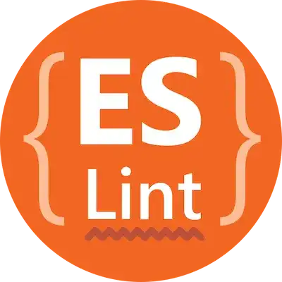

### The Power of Coding Standards

When developers think about coding standards, they often associate them with surface-level debates—such as whether to use tabs or spaces, or where to place a curly brace. However, coding standards go far beyond aesthetic choices; they are foundational for ensuring software quality and maintainability, especially in large teams where individuals may have different preferences for coding styles.

Consistency in code style reduces cognitive load, making it easier to focus on solving problems rather than deciphering various coding conventions.

### ESLint: Refining Code Quality with Static Analysis

[ESLint](https://eslint.org/) is more than just a *code formatter*. It acts as a real-time guide, using static analysis to catch errors and enforce best practices based on pre-defined style rules. For example, I have been using [Airbnb's ESLint configuration](https://www.npmjs.com/package/eslint-config-airbnb-typescript) for local development in VS Code, which includes an extensive set of rules focused on code style and performance. Initially, using ESLint felt overwhelming—errors seemed to pop up for what appeared to be minor issues. However, as I wrote more code with ESLint enabled, I realized that these errors were essential for cultivating better coding habits.

Moreover, the errors prompted me to think more deeply about why certain rules exist, which helped me learn more about how JavaScript and TypeScript operate under the hood. In this way, ESLint became more than just an error-reporting tool—it became an educational resource.

### Beyond Code Style Violations: The Value of Standards

While coding standards often emphasize stylistic consistency, their value extends far beyond detecting style violations. Well-defined standards govern code structure, logical organization, documentation of functions and classes, and more.

Additionally, coding standards enhance collaboration. When everyone on a team adheres to the same rules, code reviews become more efficient, and onboarding new developers to complex projects becomes faster and smoother.

By using tools like ESLint, we can significantly reduce the time spent on trivial issues like "fix the number of spaces" or "use lowercase characters." As a result, the development cycle becomes more efficient, allowing us to focus on more important tasks.

### Conclusion

Tools like ESLint not only enforce aesthetic choices but also serve as ongoing learning aids, helping developers understand and follow best practices with real-time feedback.