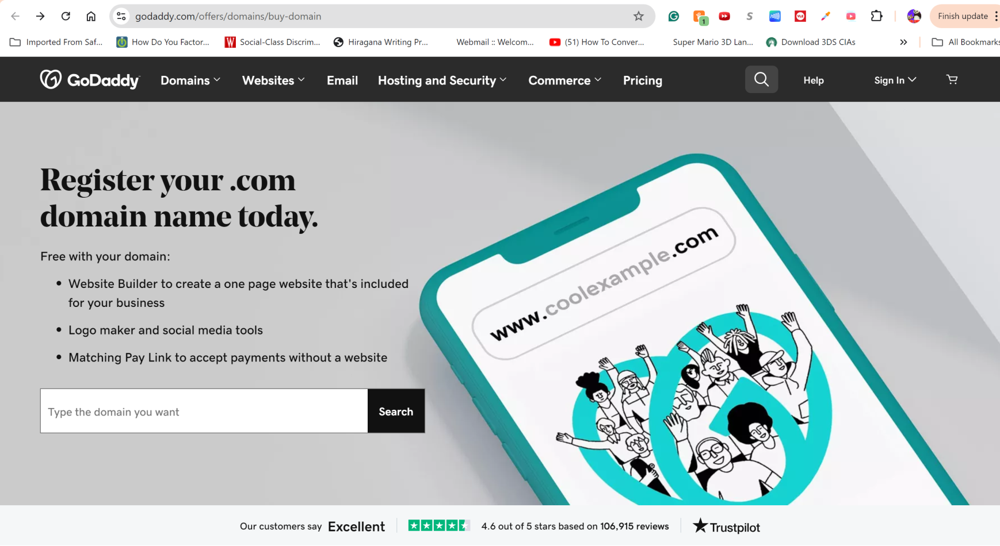
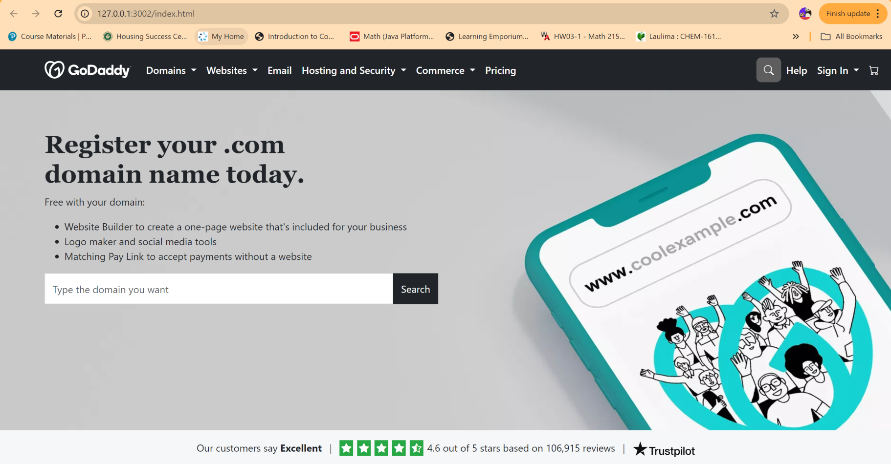

### Why Invest in UI Frameworks?

Despite the learning curve, UI frameworks offer considerable benefits, both in terms of development time and the overall quality of the user interface in comparison to raw HTML and CSS. By abstracting much of the complexity, these frameworks provide a faster way to build consistent, responsive, and visually appealing websites.

### The Drawbacks of Raw HTML/CSS

Building a website with raw HTML and CSS offers complete control over the aesthetics, but customizing layouts to make the website both visually appealing and consistent across different devices can be an exhausting process. Ensuring proper responsiveness, managing consistent margins, padding, and other elements across various screen sizes, browsers, and devices can become tedious.

In addition, writing raw CSS can feel like reinventing the wheel. Common UI components like navigation bars, modals, forms, and buttons take a significant amount of time to style from scratch. This increases the risk of inconsistent designs and layout bugs. By contrast, UI frameworks like [Bootstrap 5](https://getbootstrap.com/docs/5.0/getting-started/introduction/) provide ready-made, customizable components that dramatically speed up the process.

For example, to create a simple "Click Me" button in Bootstrap 5, we can do the following:

```html
<button class="btn btn-primary">Click Me</button>
```

This single line of code gives us a fully styled button that is responsive, cross-browser compatible, and comes with built-in hover effects and padding.

In contrast, to create a similar button in raw HTML and CSS, we need the following:

```html
<style>
.custom-button {
  background-color: #007bff;
  color: white;
  padding: 5px 20px;
  border: none;
  border-radius: 5px;
  font-size: 16px;
  cursor: pointer;
}

.custom-button:hover {
  background-color: #0056b3;
}
</style>

<button class="custom-button">Click Me</button>
```

Replicating what Bootstrap provides out of the box requires writing custom CSS. It's not just about the visual aspects--developers are also responsible for ensuring that these visual components remain consistent across multiple browsers when using raw CSS.

Below is a side-by-side comparison of the rendered buttons.

<div style="display: flex; gap: 20px; justify-content: center;">
  <div style="text-align: center;">
    
  </div>
</div>

### My Bootstrap 5 Experience

I have found Bootstrap 5 incredibly helpful in WOD problems that involve "rebuilding" complex components of websites. One example where I found this framework useful is when I need a ready-to-use navigation bar (i.e., navbar) without requiring custom CSS. This framework has allowed me to focus on the important aspects of website building, such as the content that needs to be included.

Below is a side-by-side comparison of an original [GoDaddy](https://www.godaddy.com/offers/domains/buy-domain) offers page and my Bootstrap 5 rebuild:

<div style="display: flex; gap: 20px; justify-content: center;">
  <div style="text-align: center;">
    <p><strong>Original</strong></p>
    
  </div>
  <div style="text-align: center;">
    <p><strong>Rebuild</strong></p>
    
  </div>
</div>

<br/>
This rebuild process demonstrated the power of Bootstrap's flexibility.

### Conclusion

Investing time in learning UI frameworks, such as Bootstrap 5, offers long-term benefits. By using a well-established framework, we can accelerate the web development process and create less error-prone UIs with more flexibility.