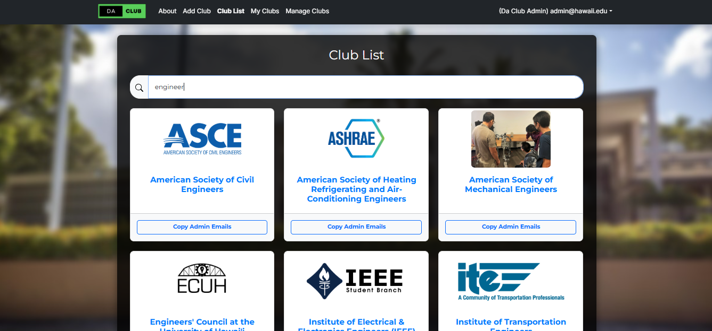

## Background

During my ICS 314 course this fall, I had the opportunity to collaborate with four peers on building [Da Club](https://daclub-gold.vercel.app/about), a club organization hub for UH Manoa students. UHM hosts over 200 Registered Independent Organizations (RIOs) alongside countless unofficial groups. Yet, there was no streamlined way for students to discover and engage with these opportunities.

Recognizing this gap, our team worked on building a platform where students could easily explore a directory of all UH Manoa clubs, learn about them, and manage club galleries, admins, interests, and much more.

## Tackling the Challenge

Creating Da Club was not just about building a functional web application but ensuring it addressed real student needs:

- **Centralized Access**: Students needed one location to find information about UHM clubs.
- **User-Friendly Interface**: The platform had to be intuitive and engaging to encourage users. 
- **Dynamic Features**: From browsing clubs to search features to managing profiles, the app required seamless interaction.

This project marked my first "real-world" full-stack development project, working on every layer in the stack.

## My Contributions

As a core member, I embraced various roles to ensure the success and delivery of Da Club. I primarily focused on the backend, where I:

- **Built Search Functionality**: Developed a dynamic API for searching for clubs in the database based on titles or interests.
- **Unified Data Models**: Continuously contributed to the data models for efficient querying and organization of the data for the app. 
- **Set Up Several Pages**: Implemented logic for modifying club information and worked on the role isolation for the app. 

Venturing outside my comfort zone, I also contributed to:

- **Page Layouts**: Developed consistent CSS and used React components to ensure a consistent UI/UX across all pages. 
- **GitHub Actions**: Worked on enabling the execution of Playwright tests whenever code was merged into the main branch.
- **Scripting**: Wrote a Python script to process real club data from a UHM spreadsheet to build a JSON file for database ingestion. Contributed to the ingestion of 100+ real clubs with full descriptions, image galleries, and more into the database.

## Reflections

Da Club not only showcases technical achievement but also highlights the importance of addressing real-world challenges through thoughtful design and development.

Be sure to check out [Da Club](https://daclub-gold.vercel.app/about). The code is open-source and can be accessed at [https://github.com/ics-314-code-crew/daclub](https://github.com/ics-314-code-crew/daclub).