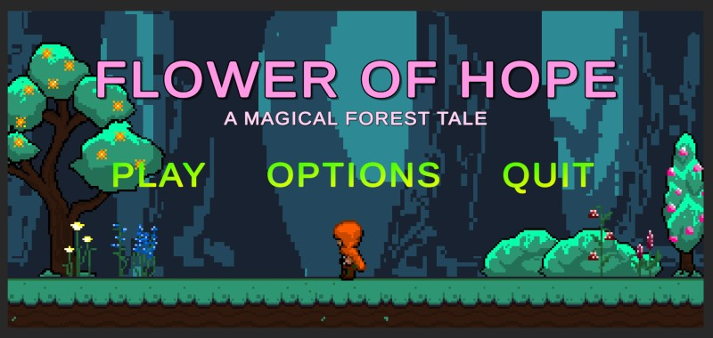

### Background

In my ICS 369 class, I was part of a group that set out to create Flower of Hope, a game that told the story of a young boy on a heartfelt mission to find a special flower to heal his sick mother. While the concept seemed simple on paper, translating it into a functional and engaging game presented its own set of challenges, particularly for me, as I had limited experience working with the Unity engine.

This project was my first deep dive into the technical aspects of building a game. Although I had always been intrigued by game development, I quickly realized that understanding Unity’s complexity required much more than theoretical knowledge. From scene management to working with game assets, I had to navigate an unfamiliar landscape. The learning curve was steep, but every step forward reinforced my excitement and curiosity.

### Making the World Come Alive

My primary responsibility in the development process was to focus on the interaction between the boy character and the objects within the game. Object interaction is essential for making a game world feel alive, and I soon discovered that C# scripts were the key to controlling these mechanics.

A huge part of creating an immersive game is ensuring the environment feels believable. My role expanded to incorporate the game’s physics, which controlled how the character interacted with different elements, like how they moved, jumped, or collided with obstacles.

### Creating a Magical Atmosphere

In addition to my technical role, I also contributed to shaping the game’s overall aesthetic. One of our goals was to create a magical, forest-like atmosphere where the players felt immersed in the journey of the boy. I learned to work with 2D sprites and animations, giving life to the trees, flowers, and backgrounds.

### Learning through Practice

By the end of the project, I had developed a much deeper understanding of Unity's interface, scene management, physics interactions, and the overall game development process.