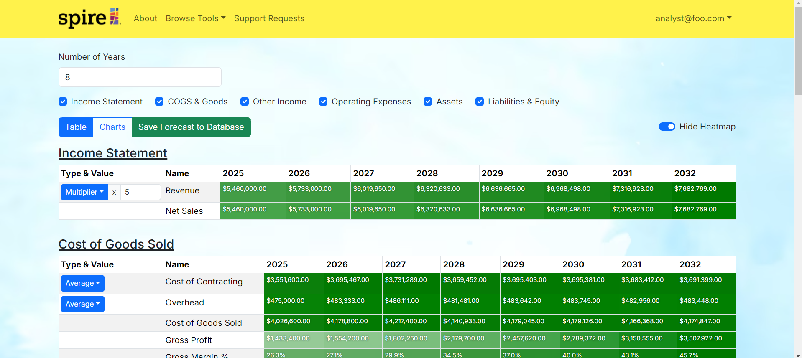

## Financial models in the browser

I worked with Spire, a local firm, on an eight-person team to convert layered Excel financial models into a web application. We used TypeScript, Next.js, React, PostgreSQL, and Prisma, and deployed the portal on Vercel.

I tested the calculations against the original spreadsheets, matching results to the cent.

## Versioned stress testing

I led the versioned stress-testing feature. I designed the data schemas, built Prisma-backed API endpoints, and created an interface for saving and reloading model versions. Memoization helped keep projections responsive as forecast horizons and datasets grew.

[View the source code](https://github.com/pineapple-spire/pineapple-spire) or [read my project reflection]({{ '/essays/ics-414-reflection.html' | relative_url }}).

