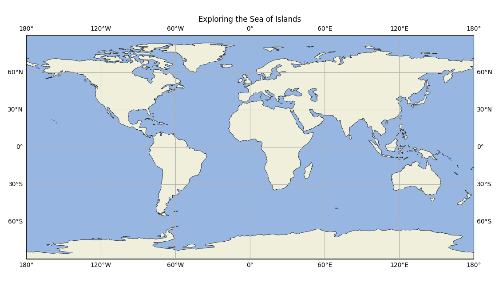

### Background

I collaborated with a team of three during the algorithms course to apply graph theory to model a collection of islands connected by directional travel routes, represented as a directed, weighted graph. Each island, a vertex, had unique attributes like population and resources, while the travel times between islands were edge weights. As the lead developer, I implemented Dijkstra's algorithm to compute the shortest paths between islands and designed a custom knowledge-sharing algorithm that prioritized visits based on population, skill gaps, and recency. This essay discusses the graph-based methods used to solve the challenges of resource distribution and knowledge sharing.

### Custom Shortest Path Algorithm

To address the need for population-weighted paths, I modified Dijkstra's algorithm to account for island populations in addition to travel time. By introducing a population-weight factor, islands with higher populations were prioritized during the traversal, ensuring leaders visited them sooner. This adaptation maintained the efficiency of Dijkstra's algorithm while adding the flexibility needed for real-world problems where both distance and population size are critical. The result was an algorithm that provided a balanced path between islands, favoring more populous destinations.

### Knowledge Sharing Among Leaders

In addition to shortest paths, I developed an algorithm for knowledge sharing that balanced multiple factors—distance, recency of visits, and skill gaps. The algorithm computed a score for each island based on these factors, using graph traversal to decide the most optimal path for a leader to follow. This approach ensured leaders could share knowledge efficiently while prioritizing islands that hadn't been visited recently or needed new skills, demonstrating the versatility of graph algorithms in complex scenarios.

### From Theory to Practice

Through this project, I deepened my understanding of graph algorithms and their real-world applications. Modifying standard algorithms to solve complex, multi-variable problems highlighted the flexibility and power of graph applications.

Source Code on GitHub: [Sea of Islands](https://github.com/jaked332/sea-of-islands)