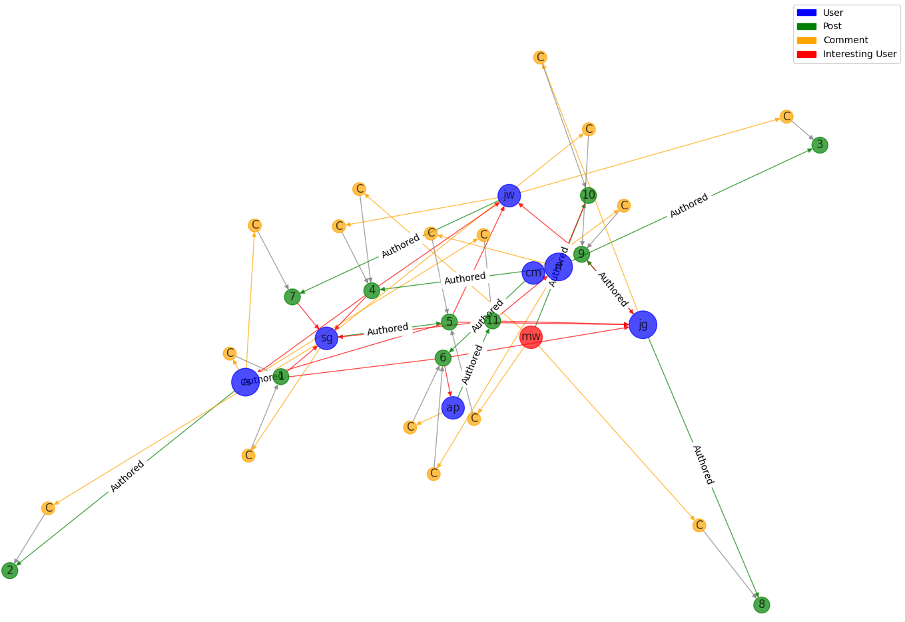

### Background

In an ICS 311 project, I worked on applying graph methods to analyze social media data, focusing on user interactions and content. The project required us to identify "interesting" users based on various attributes such as post count, comment frequency, and demographic factors. My specific contribution involved modeling the network as a directed graph using the [NetworkX library](https://networkx.org/documentation/stable/index.html) and visualizing the filtered results. By leveraging graph algorithms, we represented users, posts, and comments as nodes, with directed edges representing relationships like authorship and viewing.

### Algorithmic Approach

To filter for interesting users, I implemented a graph-based traversal that applied criteria (such as age, gender, and comment count) to user nodes. This was equivalent to finding a subgraph of nodes that met the specified conditions, such as female users under 40 who had commented more than once. Using simple comparisons on user attributes, I could dynamically generate this subgraph for further analysis. Graph theory provided an efficient way to represent these interactions, ensuring that the directed edges captured the asymmetric nature of relationships between users and posts.

### Interpretability

For visualization, I employed NetworkX's `spring_layout()` to generate a clear, interactive graph, with color-coded nodes to represent users, posts, and comments. Highlighting the filtered users in red allowed us to visually emphasize the most relevant users in the graph. This graph-theoretic approach was crucial for creating an efficient and intuitive model of social media networks, allowing analysts to easily identify key users based on multiple criteria.

Source Code on GitHub: [Social Network Analysis](https://github.com/jaked332/social-network-analysis)