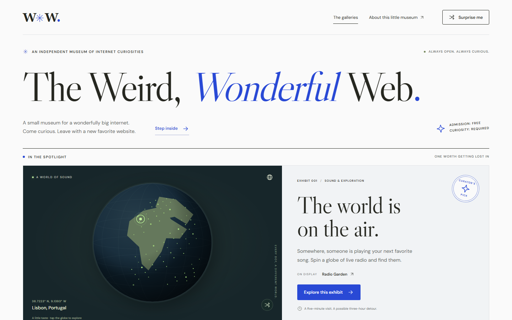

[Live museum](https://explore-web-wonders.vercel.app/) | [GitHub](https://github.com/jaked332/web-wonders)

## A museum for web discoveries

I built and deployed an interactive museum of 24 web exhibits across four galleries using React, TypeScript, and Vite. Visitors can search the collection, filter by gallery, or discover a random exhibit. Each exhibit includes a curator's note, creator attribution, and a suggested first interaction.

## Interactive previews and shared map loading

I created original CSS/SVG previews that respond to clicks, taps, and keyboard input. Fonts, illustrations, and geographic data are served locally, so browsing the museum makes no third-party requests.

The interactive globe uses D3's orthographic projection. A shared request loads geographic data once across memoized globe instances, with a fallback illustration if loading fails.

## Shareable discoveries and accessible navigation

Each exhibit has a shareable query-based URL that works on static hosting without route rewrites. Native dialogs support keyboard focus containment, Escape dismissal, focus restoration, and browser back/forward navigation. Clipboard sharing includes a manual fallback.

## Testing the experience

I added Playwright coverage for search, filtering, navigation history, sharing, random discovery, keyboard behavior, and map-loading failures. Layout checks span six viewport widths from 320 to 1920 pixels, alongside automated accessibility checks with axe-core. The responsive interface also supports reduced motion. I deployed the museum on Vercel.
